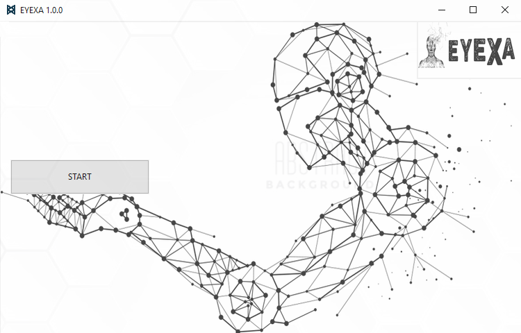
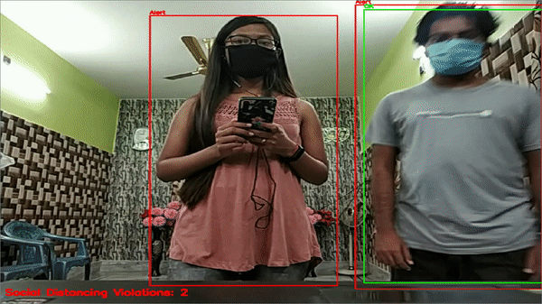
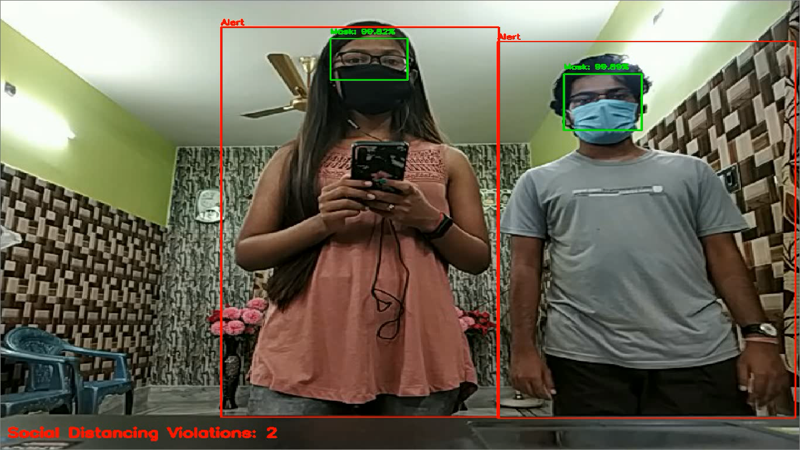
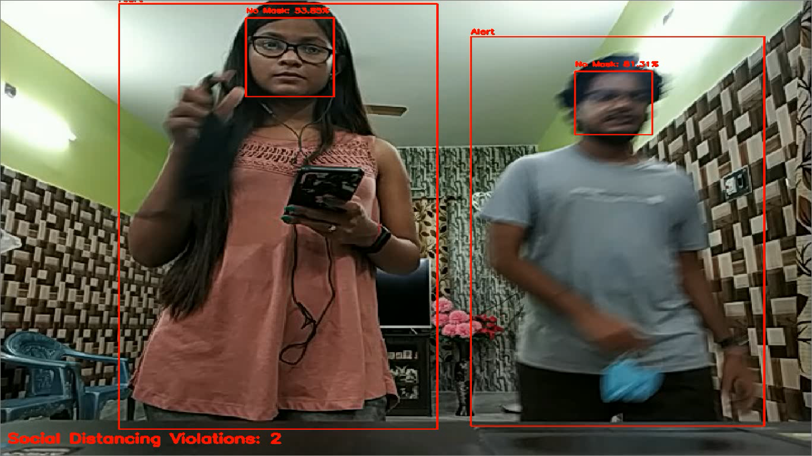
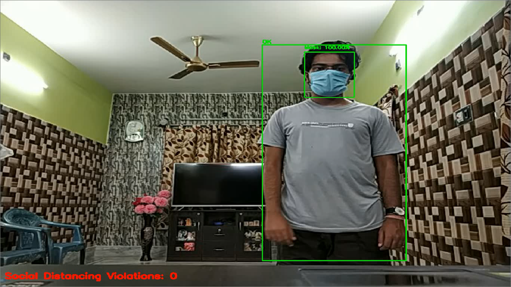
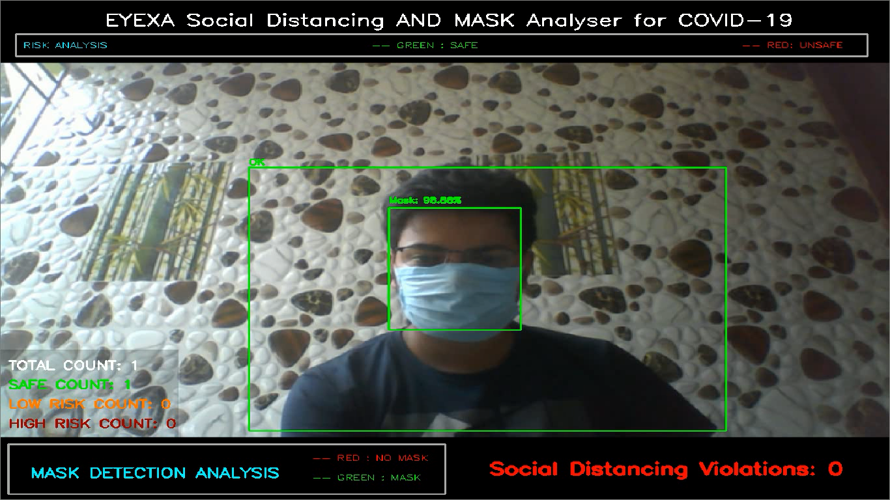

# EYEXA
A Computer Vision and Machine Learning Solution to implement Social Distancing and Mandatory Mask wearing to avoid the spread of the Covid 19 virus for TATA INNOVERSE SolverHunt 8.


## DESCRIPTION
EYEXA is a Combined Computer Vision and Machine Learning Application that recognises a person and checks if he is maintaining social distancing or not , and also checks if he is wearing a mask or not simultaneously. 

If any of the two above criteria fails then its alerts a user concerned with a warning sound , so the person violating can take necessary steps to minimise the spread of the virus. 


EYEXA performs two primary functions using multi threading , OpenCV and ML


      1.  EYEXA uses yolov3 model to track a person and then does various internal computations to check all the person in the frame are 
    maintaining a proper social distancing norms or not . and display the number of person violating the social distancing norms.
      
      2.  EYEXA uses an custom trained model based on MobileNetV2 to train on images of person wearing/not_wearing a mask , and predict 
    the person in the camera feed is wearing a mask or not . It also uses a res10_300x300_sad_iter_140000.caffemodel to focus on person 
    face during the prediction.


<p align="center">
    
    <br>
    <sup>Loading ....</sup>
</p>


<p align="center">
    
    <br>
    <sup>Authors <a href="https://www.linkedin.com/in/arnab-das-732515143" target="_blank">Arnab Das</a></sup>
</p>


<p align="center">
    
    <br>
    <sup>START SCREEN</sup>
</p>

## MASK DETECTION RESULT

<p align="center">
    
    <br>
    <sup><a href="https://github.com/raj713335/EYEXA" target="_blank"><strong>EYEXA</strong></a></sup>
</p>


## SAMPLE RESULT

<p align="center">
    
    <br>
    <sup><a href="https://github.com/raj713335/EYEXA" target="_blank"><strong>EYEXA</strong></a></sup>
</p>


## WORKING CODE

<p align="center">
    
    <br>
    <sup><a href="https://github.com/raj713335/EYEXA" target="_blank"><strong>EYEXA</strong></a></sup>
</p>


## SAMPLE IMAGES
<p align="center">
    
    
    
    
    <br>
    <sup>1.Social Distancing Violation but Mask are on (Left) 2.Social Distancing Violation and Mask are off(Right) 3 and 4. All Ok (Down Left/Right)</sup>
</p>


### Getting Started
- Clone the repo and cd into the directory
```sh
$ git clone https://github.com/raj713335/EYEXA.git
$ cd EYEXA
```


### Download The YOLOV3 Trained Model From the Following link and Save the file inside ./Model Directory

$ url : https://pjreddie.com/media/files/yolov3.weights


### Install tensorflow and all the other required libraries 

```sh
$ pip install tensorflow
$ pip install EasyTkinter
$ pip install opencv-python
$ pip install keras
$ pip install Pillow
$ pip install imutils
$ pip install numpy
```

### List of Python packages taht are being used in the Application

```sh
from tkinter import *
from tkinter.ttk import Combobox
import csv
import configparser
import tkinter as tk
from PIL import Image, ImageTk
import cv2
from datetime import date, datetime
import math
from tkinter import messagebox
from threading import Thread
import time
import socket
import tkinter.ttk as ttk
from tkinter import filedialog
import subprocess
from datetime import datetime
from home import display
from tensorflow.keras.applications.mobilenet_v2 import preprocess_input
from tensorflow.keras.preprocessing.image import img_to_array
from tensorflow.keras.models import load_model
from imutils.video import VideoStream
import numpy as np
import imutils
import time
import cv2
import os
import math
from main import mainc
from threading import Thread
from video_recorder import start
```


### To run the Application


```sh
$ cd EYEXA
$ python EYEXA.py
```

## CODE STRUCTURE

<p align="center">
    
    <br>
    <sup></sup>
</p>


### A Histogram Graph of the mask_detector.model based on mobilenet_v2


<p align="center">
    
    <br>
    <sup>TRAINING of Model mask_detector.model Histogram</sup>
</p>


## FUTURE ACTIONS


### TO ADD TEMPERATURE DETECTION IN THE EXISTING SYSTEM

# :thermometer: AiThermometer :thermometer:
Code for automatically measuring the temperature of people using a thermal camera.
The software can be freely used for any non-commercial applications and it is useful
for the automatic early-screening of fever symptoms.


<p align="center">
    
    <br>
    <sup></sup>
</p>


## Description
The software first detect people with an off-the-shelf body pose detector and then extract location of the face where the temperature is measured. The software requires a known reference temperature and the value and position are provided by the user (this information is shown as a single small green circle on the image). It is possible to have the absolute temperature but you need an image from a thermal camera with correct radiometric calibration and radiometric exif data loaded into image.

## Tested hardware
+  FLIR<sup>&reg;</sup> A600
+  FLIR<sup>&reg;</sup> A315

